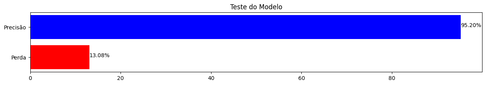
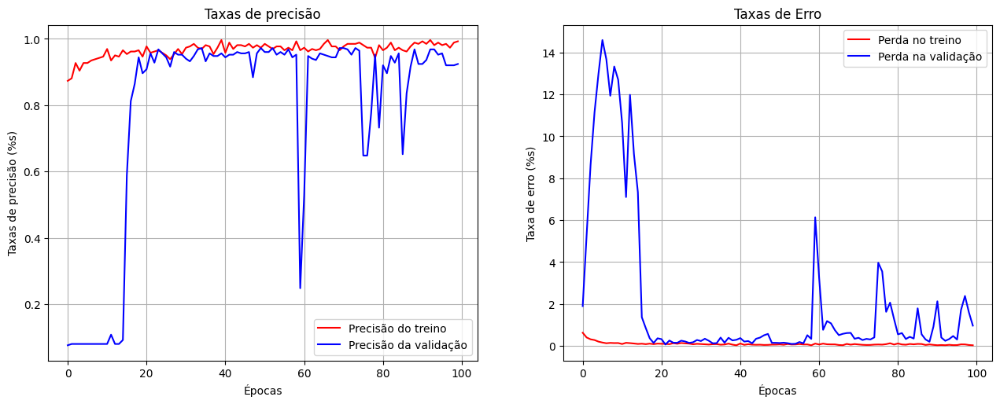
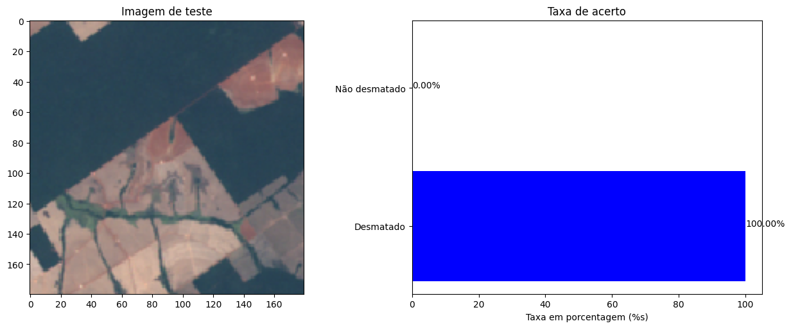
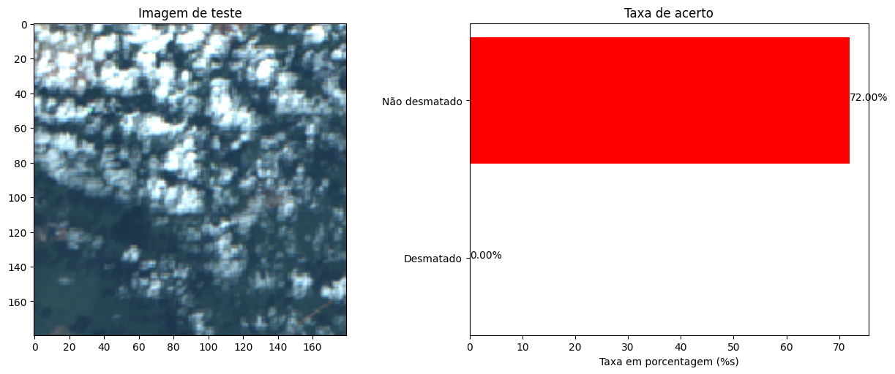
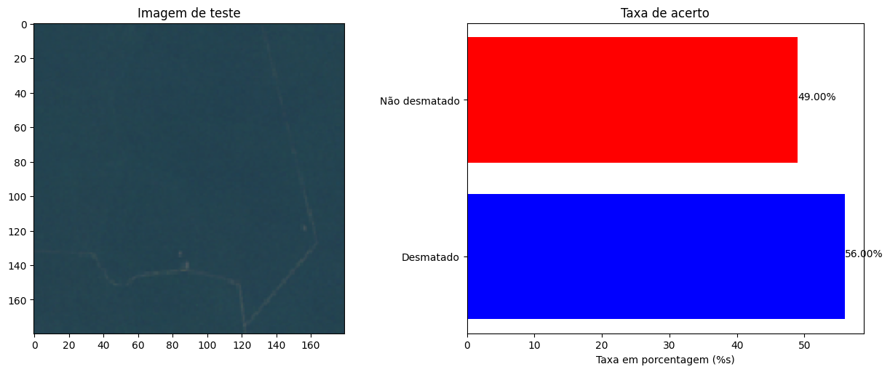
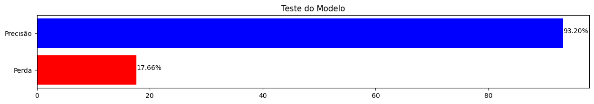
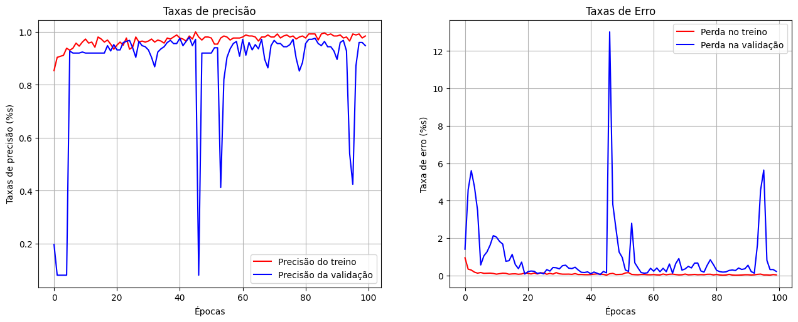
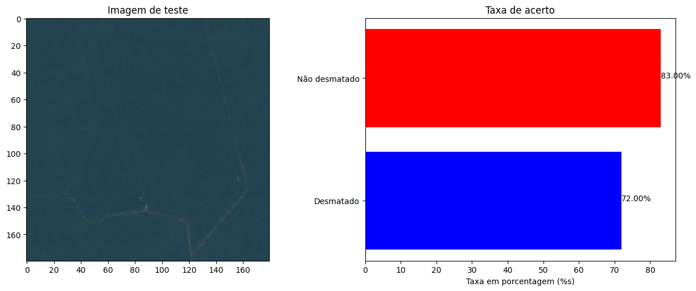

## 🤔 O que é a APS ?

    As Atividades Práticas Supervisionadas (APS) são trabalhos que ocorrem a cada semestre, nos quais o tema e o orientador são diferentes. Assim, a cada semestre, uma APS é aplicada com um tema diferente.
     
    O foco da APS em Ciência da Computação é estimular os alunos a aprimorar as habilidades desenvolvidas durante as aulas e os laboratórios ao longo da semana. Com o passar do tempo, os projetos e os temas propostos tendem a se tornar mais desafiadores.

## 🚩 Sobre o projeto

    No decorrer do semestre, foi proposto o desenvolvimento de um algoritmo capaz de identificar regiões desmatadas e não desmatadas na Amazônia, utilizando imagens de satélite.
      
    O primeiro projeto envolveu o uso de filtros nas imagens, o que possibilitou o reconhecimento de determinadas regiões desmatadas. No entanto, em alguns pontos, especialmente onde havia um grande volume de sombras ou semelhanças na cor com os rios, tornava-se incerto determinar se a região estava desmatada ou não.
      
    Devido a esse desafio, após a aplicação dos filtros, foi proposto a nós o desafio de criar um modelo de aprendizado de máquina capaz de reconhecer regiões desmatadas com a maior precisão possível.

## ⚠️ Observações sobre o projeto

    Conforme descrito anteriormente, o primeiro projeto envolveu apenas o uso de filtros para detectar padrões de desmatamento. Dado que este repositório tem como foco principal o uso de redes neurais, decidimos disponibilizar apenas o código fonte da rede.

## 🧰 Ferramentas utilizadas
Segue de forma simples uma lista e uma breve descrição sobre a ferramenta:

- 🐍 **Python**  
O foco do uso desta linguagem está no fato que possui uma grande biblioteca, facilitando a implementação de recursos como o processamento de imagem e nas redes neurais.

- 🗺️ **IMPE - site**  
Foram retirados imagens do satélite Amazonia1 e entre outros disponíveis através do site [oficial dele](http://www.dgi.inpe.br/catalogo/explore).

- 🌎 **Qgis - software**  
Software Open-Source focado em análise, visualização e georreferência, contudo foi utilizado para mesclar camadas das imagens via satélite. 
É possível acessar o [site por aqui](https://qgis.org/pt_BR/site/).

#### 📚 Bibliotecas utilizadas

- 🤖 **Tensorflow & Keras**  
Biblioteca de código aberto focado em aprendizado de máquina e Keras consegue rodar em cima de Tensorflow, permitindo uma maior agilidade e praticidade na construção de redes profundas. Facilitando o desenvolvimento do projeto.

- 📊 **Matplotlib**  
Matplot é capaz de gerar inúmeros gráficos, até mesmo gráficos animados, neste sentido foi utilizado o Matplot para gerar gráficos e resultados obtidos através das imagens.

- 🧮 **Numpy**  
Focada em calculos e operações matemáticas, foi utilizada para criar matrizes com o foco de exibir as imagens e fazendo a predição da rede.

- 🖼️ **OpenCV**  
Utilizada no processamento de imagens, visão computacional e no uso do aprendizado de máquina. Foi utilizada para carregar as imagens e exibir nos gráficos.

- 💻 **OS**  
Biblioteca padrão do Python ela oferece as funcionalidades que integram o sistema operacional. Seu principal uso está na implementação do dataset.

## 📈 Resultados e conclusões.

    Dentro deste projeto foram feitos uma bateria de testes que mostravam diferentes gráficos e taxas de acertos diferentes, assim será exibido dois testes diferentes e no final deixarei minha opinião sobre o código e pontos que poderiam ser melhorados.

### Primeio teste.

    <h4 align="center">A taxa de precisão e o gráfico mostrando mais detalhes em relação as epochs.</h4>
    
    

    <h4 align="center">Teste de uma região desmatada.</h4>
    
    <h4 align="center">Teste de uma região não desmatada.</h4>
    
    <h4 align="center">Teste de uma região não desmatada.</h4>
    

### Segundo teste.

    <h4 align="center">A taxa de precisão e o gráfico mostrando mais detalhes em relação as epochs.</h4>
    
    

    <h4 align="center">Teste de uma região desmatada.</h4>
    
    <h4 align="center">Teste de uma região não desmatada.</h4>
    
    <h4 align="center">Teste de uma região não desmatada.</h4>
    

### 🖋️ Conclusão

    É possível analisar que durante a bateria de testes houve determinados erros em relação a ultima imagem, na qual identifica a região como desmatada, assim como algumas taxas de acerto apresentava uma incertaza.
     
    Este problema poderia ser resolvido ao aumentar a quantidade de dados presente no dataset, diminuindo o overfitting. Assim como o uso da aplicação de filtros para facilitar o reconhecimento de padrões na rede neural.

## 👀 Notas do Autor sobre o projeto:

    Gostaria de compartilhar minhas opiniões sobre o projeto e as experiências que obtive durante o processo. Pois bem, primeiramente gostei de fazer este trabalho, houve muitos baixos e altos, principalmente baixos (hahahaha 🤡) pois um dos maiores problemas e dores de cabeças que enfrentei foi na construção de um dataset, lembro-me de ficar um dia inteiro ajustando e melhorando o dataset, embora que o resultado final não me agrada.
     
    Mas olhando agora, após ter passado  quatro meses em relação a este projeto (sim, o commit chegou atrasado, me desculpe 🙏) vejo que poderia ter feito de uma forma que não fosse tão extremo  ao ponto de precisar virar o dia inteiro e ter dormido apenas 2 horas. Por exemplo buscar alternativas mais simples em vez de correr atrás de imagens do próprio satelite, ENTRETANTO teria feito o mesmo, aprendi coisas "fora do campo" e não me arrependo de ter perdido 10 anos de vida no processo (hahaha 😢). 
     
    Por fim se eu fosse mexer novamente neste projeto, um dos principais focos estaria no dataset, vejo ele como o maior problema deste projeto, desse modo quem for visualizar no futuro e queira pegar ele e não tenha nada de atualização relacionado ao dataset, lembre-se que este será o seu desafio.
    <h4>Espero que não levem a sério tudo que esteja escrito, apenas brinquei em determinados pontos, exagerando em determinadas situações. 🙌</h4>

